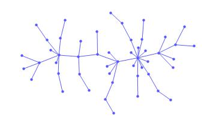
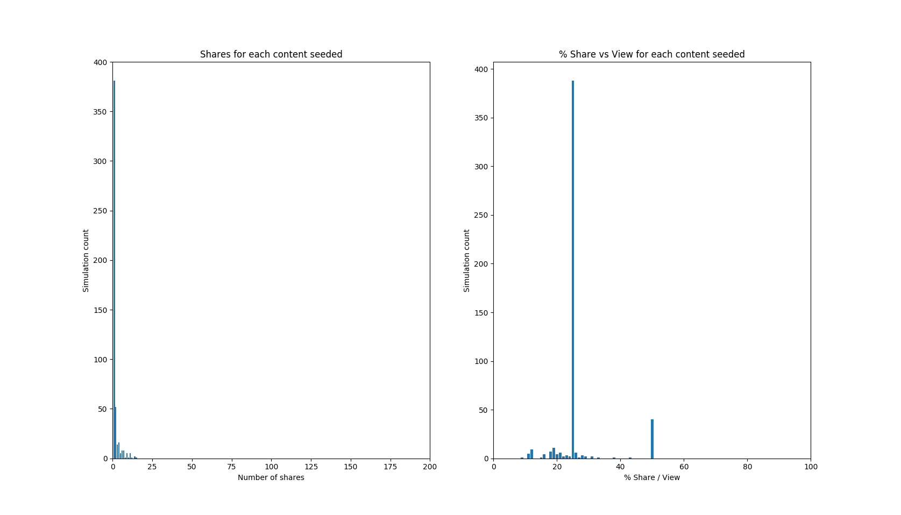
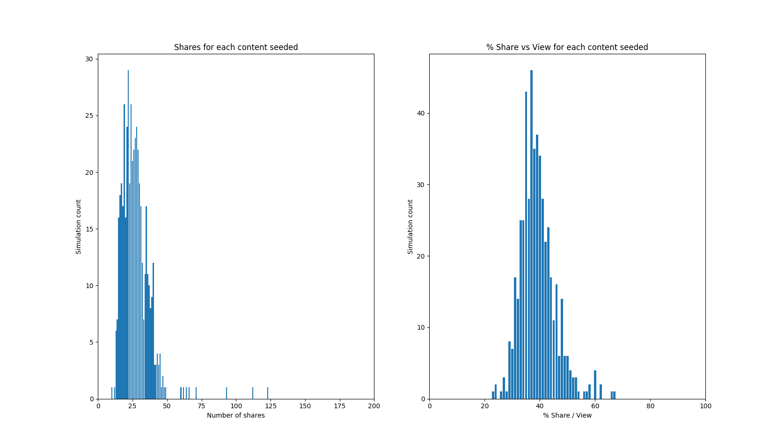
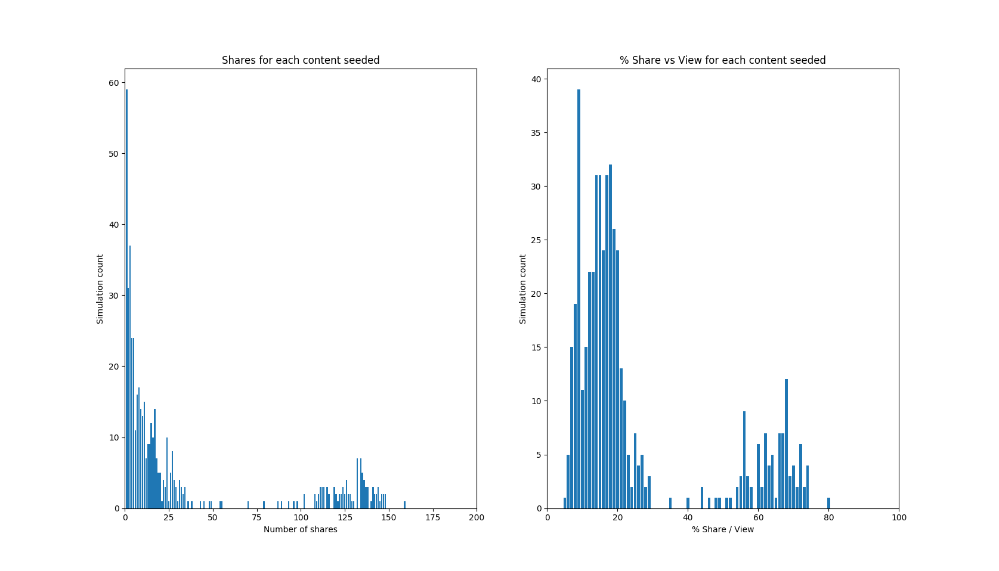
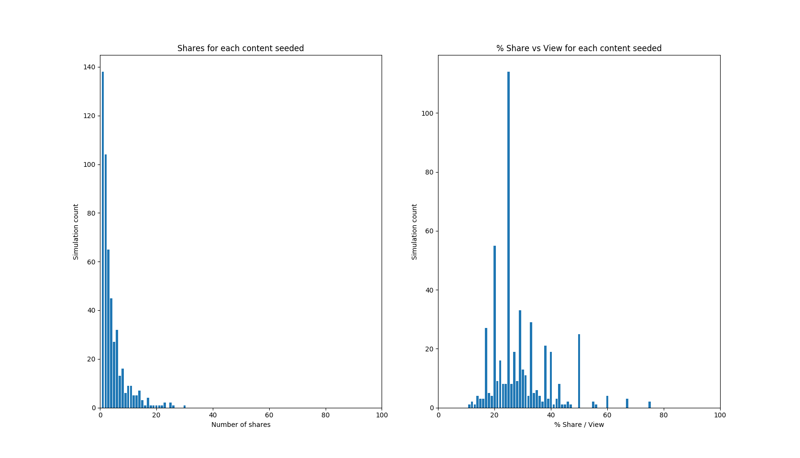
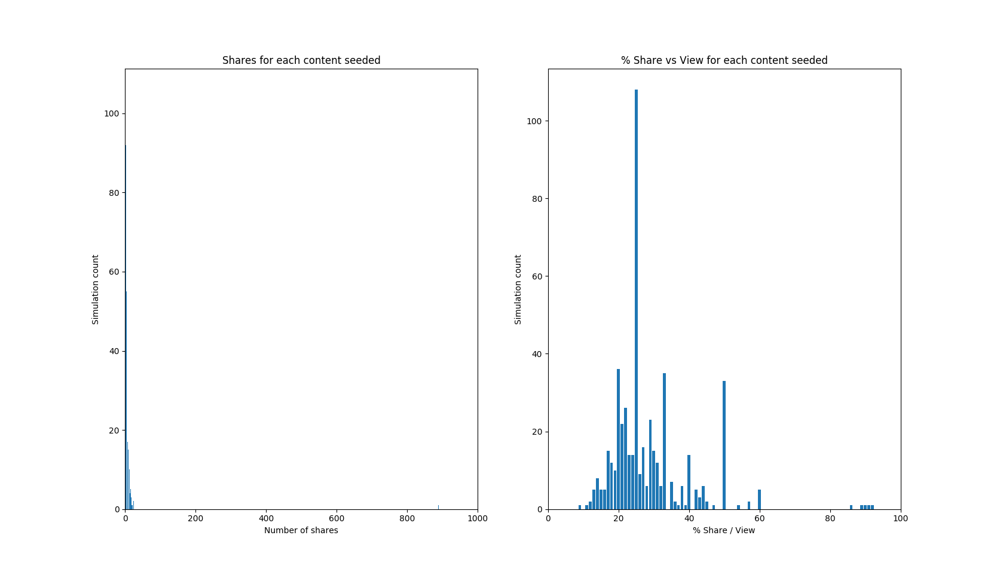

# Virality Simulator

## Overview

This project simulates content going viral on a generated social network using a preferential attachment mechanism. 
Content decays exponentially over time, but grows in popularity linearly based on shares. 
Each person in the graph has a random chance of sharing any content based on whether their neighbours (friends) have shared it or not, 
as well as how much they are interested in the content. If a content decays below a certain point, it can no longer be viral and is considered as expired.

## Graph properties

Here's what a generated network looks like using the Barabasi-Albert algorithm:

It uses two parameters: **m** and **n**. **n** defines the number of nodes, and **m** defines the connectivity level.
Read more: https://en.wikipedia.org/wiki/Barab%C3%A1si%E2%80%93Albert_model 

## Simulations

Each graph below is generated using 500 simulations.

### Seeding content into nodes with few network
This simulation is generated with 200 nodes with a connectivity level of 3. The node with the least neighbors starts with the content.

On the left, the y-axis shows how much content was shared and the x-axis shows how many nodes shared the content. 
Based on the graph, not a lot of content goes viral if someone who doesn't know a lot of people shares something.

In this graph, the 10 nodes with the least neighbors share the content. The graphs are shifted more towards the right, meaning that there are some pieces of content that end up going viral, but obviously with a low probability.

### Seeding content randomly into a highly connected network

Compared to the graphs in the previous section, a lot more content goes viral in this environment.
This makes sense because if the graph is more connected, then it takes less shares to reach a broader audience, and more content visibility increases the likelihood of the content being shared again.

### Seeding content randomly into big vs small network
The following graph was generated with only 100 nodes at a connectivity level of 3

The following graph was generated with 1000 nodes at a connectivity level of 3

Both graphs show approximately the same thing. It's hard to see from the second graph, but the distribution is approximately the same as the distribution from the first graph.
If we look carefully, it's possible that there's a slight increase in content going viral if we compare both right graphs. However, the difference isn't significant so it's hard to say.

## Running the simulations.
Set up a virtual environment using python3. Afterwards, run `pip install -r requirements.txt`. Make sure you also have `matplotlib.`

You can then run `python vs.py [seed_popular_nodes] [seed_unpopular_nodes]`. Change the constants in `constants.py` to generate different graphs.
